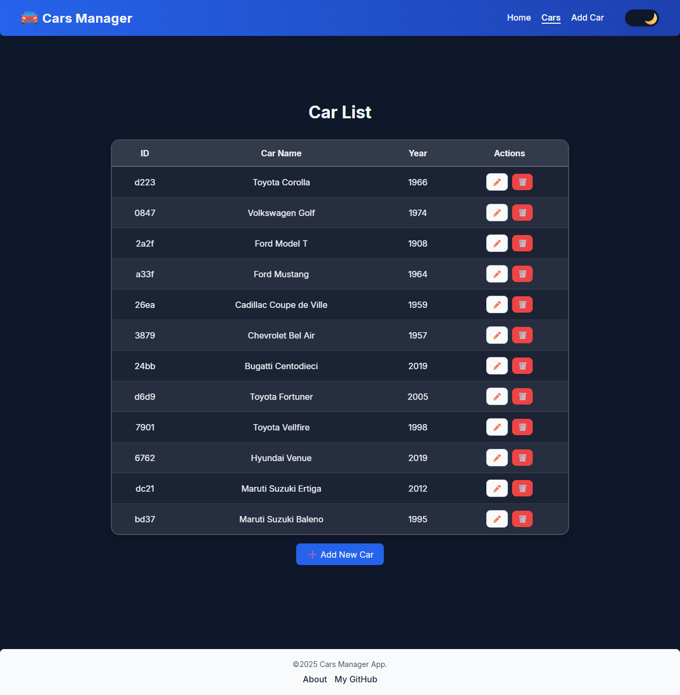

# CarsCRUD

A simple web app allows you to manage your car database — add, edit, and delete cars in just a few clicks.

## 🌐 Live Demo
[View Website](https://my-o-o.github.io/CarsCRUD/)

## ✨ Features
- Responsive design for desktop and mobile.
- The data is stored in a local JSON file using **json-server**.
- The interface is built entirely with React functional components.

## 📸 Preview

